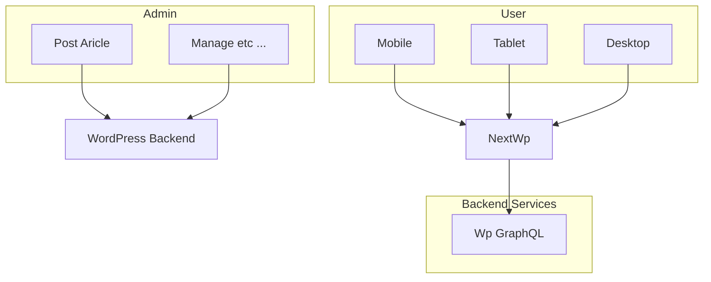

# Introduction
 
Welcome to Nextwp Documentation! You're right here, and I'm sure you'll try NextWp soon.

## What is NextWp?

**Nextwp is a headless for WordPress site**, nextwp is a front end developed with NextJs. Nextwp was developed using NextJs version 14, using an app router architecture, which can **maintain SEO techniques** while still paying attention to an attractive and modern **User Interface**, as well as providing a **good experience** for its users :)

## What are the advantages of using nextwp for your site?

You can separate and split the interface between admin and user:

You can improve and maintain SEO quality, NextWp provides opportunities for search engines to crawl quickly and in a structured manner. NextWp has been integrated with the RankMath plugin, every nextwp communication with your WordPress backend is well protected.